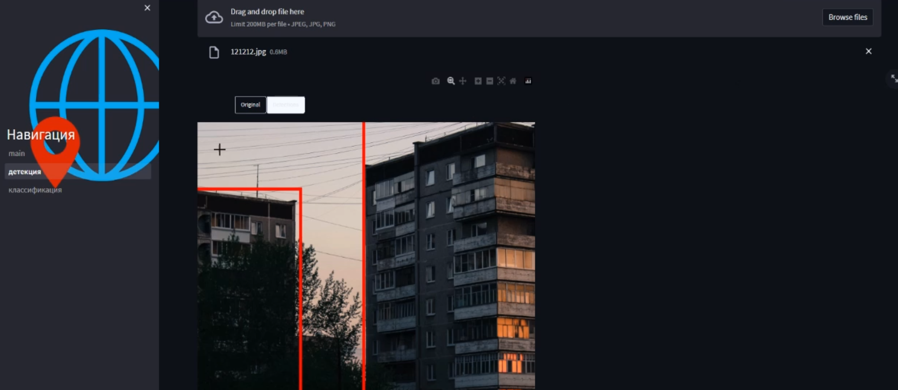

# Приложение классификтор и детектор архитектурных стилей 

Двустраничное приложение. На первой странице детекция, на второй - классификация.




Установка зависимостей:
```
pip install -r requirements.txt
```


Запуск приложения локально:
```
streamlit run main.py
```

За моделями обращайтесь в тг.